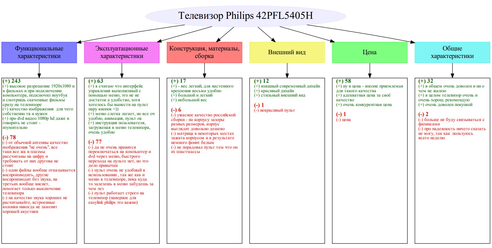

# summarizing-customer-reviews
This repository contains notebook and datasets for our product reviews summarization research. The reviews summarization task has gained much importance because of the rapid growth of number of product reviews. Furthermore, many reviews are unstructured and long. This makes it difficult to read a lot of reviews in a limited time. 

We used product review documents from Yandex.Market as target data. A collection of products from different product type was needed to show the effectiveness of the proposed approach. Five models of products from different product type were selected for our task: coffee machines, robot vacuum cleaners, e-books, televisions, washing machines. 

Our task is performed in main five phases. First, expert determination of thematic aspect categories. We define thematic aspect categories using the existing conceptual representation of the technical devices. Also, our approach is based on the results of research in the field of marketing analysis of consumer behavior and economic theory. The next phase is classifying sentences into the predefined aspect categories. We use FastText word embbeddings as a basis for sentence embeddings. We train FastText model on own text corpus. To derive the sentence embeddings we apply a centroid method. It derives sentence embeddings as the sum of individual word embeddings in a sentence weighted by their tf-idf score, and divided by the sum of these tf-idf scores. The resulting sentence embeddings are then used as data for several machine learning methods. After sentences classification, Sentiment Analysis is performed. We are carrying out Sentiment Analysis on the categories that we have previously classified sentences on. Also, we calculate sentiment score for each aspect category. The next phase is sentences ranking. We use the TextRank algorithm to find the most relevant sentences. After all the previous phases, we generate the final aspect-based reviews summary using the graphviz library. 

The proposed approach allows to structure information for every aspect category, provides calculation sentiment score for each aspect category, as well as shows the most relevant sentences for each aspect.

An example of a summary by proposed approach:

